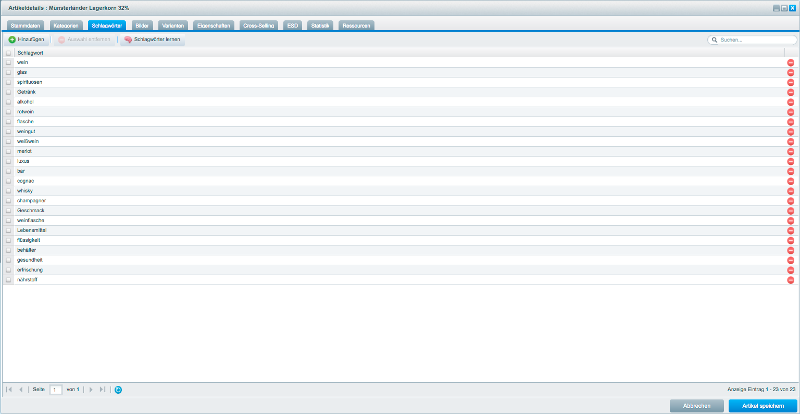

# SwagAiSearch
## About SwagAiSearch
This plugin makes it possible to allow product search in your shopware shop by image data.
You can decide to make a screenshot with your webcam or to upload your image to start an image
based product search.

This plugin uses the web-api of [clarifai.com](clarifai.com). Please see [terms of use](https://clarifai.com/terms)
for further information.

###Overview of features
- Add keywords to existing products for ai search
- Send your product image data to get predictions for your images from clarifai.
- Productsearch via screenshot or uploaded image data

## Preview

## License

The MIT License (MIT). Please see [License File](LICENSE) for more information.